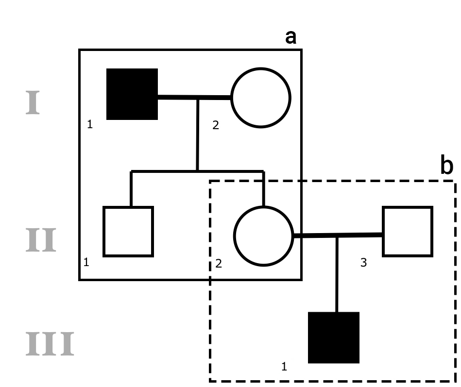
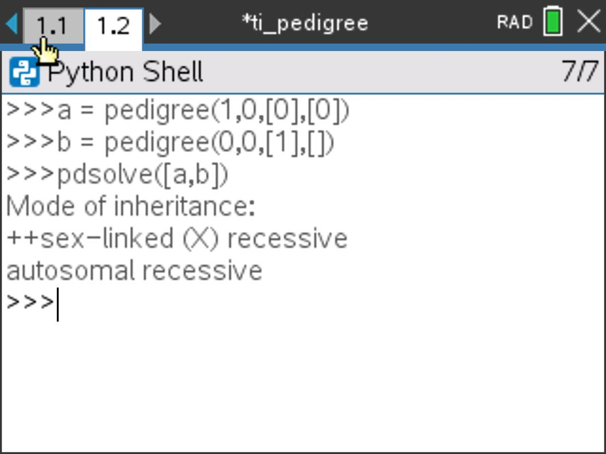

# ti_pedigree

Pedigree solver for the TI-Nspire CAS Calculator.

## Introduction

**ti_pedigree** is a pedigree solver for the TI-Nspire CX CAS II-T calculator and the TI-Nspire CX CAS Student Software. It gives you the complete table of (weighted) solutions, but you must use your judgment to decide which solution is correct.

## Usage

Read **the user guide** for more information.

## Screenshots

## License

All rights reserved.
